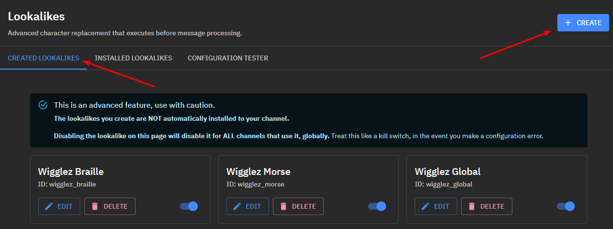
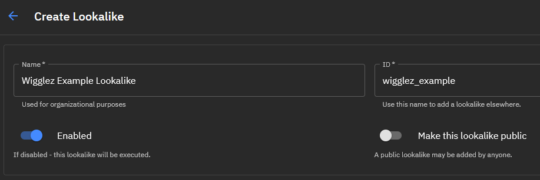
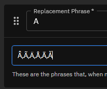
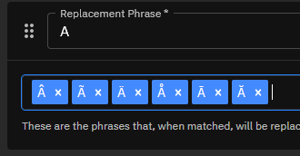

# Creating a Lookalike

## Navigation

First, navigate to your channel's dashboard (or a preset) that you wish to host the lookalike on, and make your way to the `CREATED LOOKALIKES` section. Here you will see your created lookalikes that you can edit, delete, and disable at a global level (like a killswitch).

Let's create our first lookalike. Click the `CREATE` button.

## Naming Scheme and Sharing

From here, we enter some information about how people will (or won't) be able to use your lookalike.

### Name

The `Name` is only used for your own reference of the lookalike's intended purpose. It has no impact on the lookalike.

### ID

The `ID` is used for adding this lookalike to your channel (or even remote channels or presets that are not yours). In the example screenshot below, you can see I used `wigglez_example`, which is what people would use to add this lookalike to their own channels. Using your username as a prefix is a good way to demonstrate ownership of this lookalike, as well as keep track of which lookalikes are yours during `Configuration Testing`.

### Enabled

`Enabled` is the same killswitch from the main lookalikes page. Turn this off if you want to prevent it from being used at a global level.

### Make this Lookalike Public

`Make this lookalike public` will allow people to use this lookalike on their channel or preset. If this is disabled (which it is by default), only the channel or preset that created it will have the ability to install it. **A public lookalike does not mean people have modification or viewable privilege to your Phrase Groups and phrase entries!**

## Defining Replacements

Next, we can start defining a replacement. Click `CREATE PHRASE` and a `Phrase Group` box will appear. Let's say I want to replace all `A` confusable characters. I will enter `A` into the `Replacement Phrase`, and then enter `Â` into the phrases section. **You must hit your enter key after each phrase entered.**

Whenever we receive a message in chat that contains `Â`, it will now be replaced with `A` for your blocked term or keywords to understand and process.

### Adding Phrases in Bulk

If you want to add phrases in bulk, you can use the `,` delimiter to separate your phrase entries. This would look like `Â,Ã,Ä,Å,Ā,Ă`

If you don't like the order these phrases were entered, each one can be individually moved around to a preferred order.

### Phrase Group Attributes

Each `Phrase Group` box is or has:

- draggable (to reorder their position and execution flow)

- able to be individually disabled/enabled

- a `...` menu, where you can:

  - Sort phrases
  
  - Copy to clipboard (for easy pasting, such as a Google sheet for backup purposes)
  
  - Delete phrase group, which does exactly what it sounds like. The selected `Phrase Group` will be deleted. A confirmation box will appear to prevent accidental removal.
  
- an expand button, to open or hide the `Phrase Group`

All `Phrase Group`s will be automatically collapsed on page load. Newly created phrases will expand automatically.
